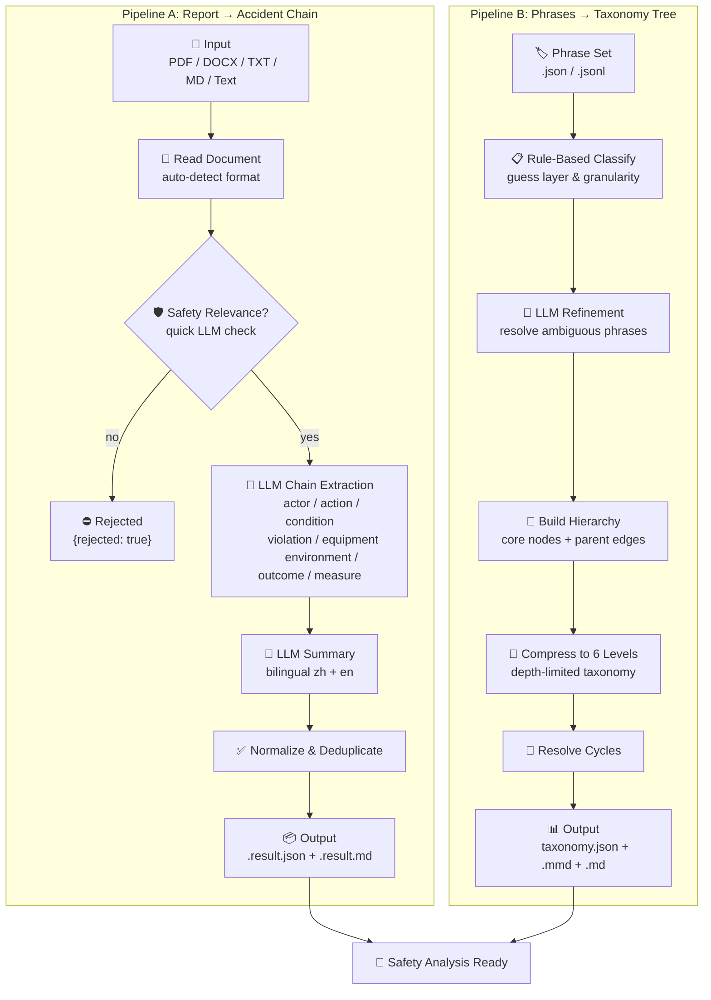
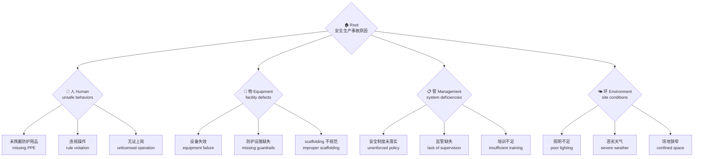

[English](README.md) | [中文](README.zh-CN.md)

# Safety Reports Skill

Two independent skills for safety incident analysis:

| Skill | Input | Output | Package |
|---|---|---|---|
| **Pipeline A** | Safety report (PDF/DOCX/TXT/MD/pasted) | Accident summary + chain items | `safety_reports_skill` |
| **Pipeline B** | Phrase set JSON | Cause taxonomy tree | `phrase_taxonomy_skill` |

## How It Works



## Taxonomy Structure

The taxonomy organizes accident causes into **4 layers**, building a tree from root causes down to specific surface-level phrases:



Each node carries metadata: `layer`, `granularity_level` (1=root → 6=specific), `is_root`, and `node_kind` (phrase / core / group).

## Install

```bash
pip install -e .
# Or with file format support (PDF, DOCX):
pip install -e ".[file]"
```

## CLI Commands

```bash
# Pipeline A: safety report → accident chain
safety-reports-skill --file example/dongguan-0001.pdf --output-dir outputs --model deepseek-chat

# Or with pasted text:
safety-reports-skill --text "accident report content..." --output-dir outputs --model deepseek-chat

# Pipeline B: phrases → taxonomy tree
accident-phrase-taxonomy-skill --input data/taxonomy_phrases_unique.json --output outputs/taxonomy.json
```

## Environment Variables

- `ACCIDENT_NLP_LLM_MODEL` (or `OPENAI_MODEL`)
- `ACCIDENT_NLP_LLM_API_KEY` (or `OPENAI_API_KEY`)
- `ACCIDENT_NLP_LLM_BASE_URL` (or `OPENAI_BASE_URL`)

## Project Structure

```
├── src/
│   ├── safety_reports_skill/    # Pipeline A
│   └── phrase_taxonomy_skill/   # Pipeline B
├── scripts/
│   ├── run_safety_reports_skill.py
│   ├── run_phrase_taxonomy_skill.py
│   ├── clean_taxonomy_benchmark.py
│   └── fix_benchmark_prompt.py
├── tests/
│   ├── test_safety_reports_skill.py
│   └── test_taxonomy_skill.py
├── data/
│   ├── taxonomy_phrases_unique.json
│   └── taxonomy_phrases_benchmark.cleaned.jsonl
├── example/
│   └── dongguan-0001.*
└── outputs/
```

## Tests

```bash
python -m pytest tests/ -v
```
