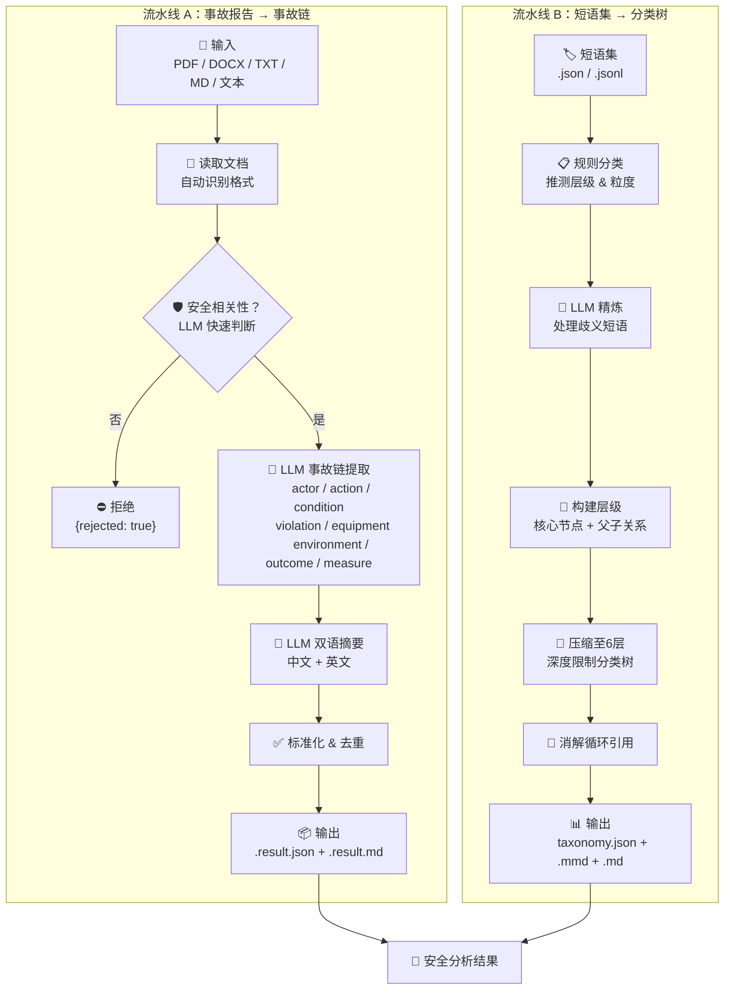
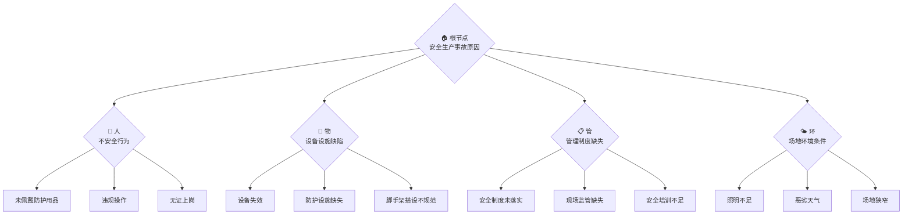

[English](README.md) | [中文](README.zh-CN.md)

# 安全事故报告分析技能

两个独立的安全事故分析技能：

| 技能 | 输入 | 输出 | 包名 |
|---|---|---|---|
| **流水线 A** | 安全事故报告（PDF/DOCX/TXT/MD/粘贴文本） | 事故摘要 + 事故链要素 | `safety_reports_skill` |
| **流水线 B** | 短语集 JSON | 原因分类树 | `phrase_taxonomy_skill` |

## 工作流程



## 分类树结构

分类树将事故原因组织为 **4 个层面**，从根原因向下展开至具体表层短语：



每个节点包含元数据：`layer`（所属层面）、`granularity_level`（1=根节点 → 6=最具体）、`is_root`、`node_kind`（phrase / core / group）。

## 安装

```bash
pip install -e .
# 如需文件格式支持（PDF、DOCX）：
pip install -e ".[file]"
```

## CLI 命令

```bash
# 流水线 A：安全事故报告 → 事故链提取
safety-reports-skill --file example/dongguan-0001.pdf --output-dir outputs --model deepseek-chat

# 或直接粘贴文本：
safety-reports-skill --text "事故报告内容..." --output-dir outputs --model deepseek-chat

# 流水线 B：短语集 → 分类树
accident-phrase-taxonomy-skill --input data/taxonomy_phrases_unique.json --output outputs/taxonomy.json
```

## 环境变量

- `ACCIDENT_NLP_LLM_MODEL`（或 `OPENAI_MODEL`）
- `ACCIDENT_NLP_LLM_API_KEY`（或 `OPENAI_API_KEY`）
- `ACCIDENT_NLP_LLM_BASE_URL`（或 `OPENAI_BASE_URL`）

## 项目结构

```
├── src/
│   ├── safety_reports_skill/    # 流水线 A
│   └── phrase_taxonomy_skill/   # 流水线 B
├── scripts/
│   ├── run_safety_reports_skill.py
│   ├── run_phrase_taxonomy_skill.py
│   ├── clean_taxonomy_benchmark.py
│   └── fix_benchmark_prompt.py
├── tests/
│   ├── test_safety_reports_skill.py
│   └── test_taxonomy_skill.py
├── data/
│   ├── taxonomy_phrases_unique.json
│   └── taxonomy_phrases_benchmark.cleaned.jsonl
├── example/
│   └── dongguan-0001.*
└── outputs/
```

## 测试

```bash
python -m pytest tests/ -v
```
